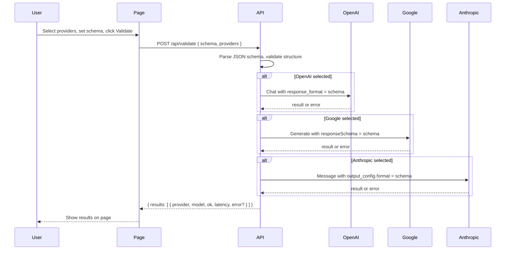

# Structured Schema Validator – Implementation Plan

## Goal

Build **Structured Schema Validator** as a **minimal monorepo** (same stack as [bizsist-mono](https://github.com/codygo-ai/bizsist-mono): pnpm, Turbo, TypeScript, shared ESLint/tsconfig). The **Next.js validator site** is one package; it validates JSON schemas for use with LLM structured outputs. Users choose one or more model families (OpenAI GPT-4+, Google Gemini 2.5+, Anthropic Claude 3.5+), provide a schema (Monaco editor, paste, or file), and the app validates by calling each provider’s **min-cost model** that supports structured outputs with that schema. Results are shown on the page.

---

## 1. Product behavior (clarifications)

- **Validation meaning**: For each selected provider, the app calls that provider’s API with the user’s schema (e.g. `response_format` / `responseSchema` / `output_config`) and a minimal prompt. “Valid” = the API accepts the schema and returns a valid response; “invalid” = API error or unsupported schema (with error message shown).
- **Model mapping (min-cost, same semantics)**:
  - **OpenAI**: e.g. `gpt-4o-mini` or `gpt-4o` (structured outputs supported; pick cheapest that supports the feature).
  - **Google**: e.g. `gemini-2.5-flash` or `gemini-2.0-flash` (structured outputs via `responseSchema`).
  - **Anthropic**: e.g. `claude-3-5-haiku` or `claude-3-5-sonnet` (structured outputs via `output_config.format`).
- **Results**: Shown on the same page: per-provider status (success / failure), model used, latency, and error details if any. Optional: client-side “is it valid JSON Schema?” before calling APIs.

---

## 2. Monorepo and tech stack

**Monorepo (aligned with bizsist-mono, minimal):**


| Layer         | Choice                                        | Notes                                       |
| ------------- | --------------------------------------------- | ------------------------------------------- |
| Package mgr   | pnpm (workspaces)                             | `pnpm-workspace.yaml` with `packages/*`     |
| Build/tasks   | Turbo                                         | `turbo.json`: build, lint, typecheck        |
| Node          | Engine e.g. `>=22`                            | Via root `.npmrc` / `package.json` engines  |
| Shared config | `packages/tsconfig`, `packages/eslint-config` | Base tsconfig + shared ESLint (flat config) |


**Web app (one package):**


| Layer          | Choice                                           | Notes                                                        |
| -------------- | ------------------------------------------------ | ------------------------------------------------------------ |
| Framework      | Next.js 15 (App Router)                          | In `packages/web`; API routes for server-side provider calls |
| Language       | TypeScript                                       | Strict; extends shared tsconfig                              |
| Editor         | Monaco Editor (e.g. `@monaco-editor/react`)      | JSON editing, syntax highlighting                            |
| Styling        | Tailwind CSS                                     | Codygo-like layout and components                            |
| Schema parsing | `ajv` or built-in `JSON.parse` + draft detection | Validate JSON and optionally JSON Schema draft               |
| API calls      | Server-side only                                 | Keep API keys on server (env vars)                           |


---

## 3. Look and feel (Codygo-like)

Align with [codygo.com](https://codygo.com/) and [codygo.com/platform](https://codygo.com/platform/):

- **Tone**: Professional, “enterprise-grade,” GenAI/tooling. Clear headings and short copy.
- **Layout**: Clean single-page or short flow: hero → main tool (schema input + model choice) → results. Optional footer with “By Codygo,” link to repo, and contact.
- **Visual**: Prefer a dark or strong-contrast theme; bold typography (e.g. a strong sans for headings); subtle gradients or accent color for CTAs; cards/sections for schema editor and results.
- **Content**: Short value prop at top (“Validate JSON schemas for LLM structured outputs”); one line on “Pick providers, paste schema, see results”; open-source and “Structured Schema Validator by Codygo” clearly stated.

No need to replicate full Codygo marketing site; one focused validator page plus minimal shell (header + footer) is enough.

---

## 4. Repo and site structure

**Repo (minimal, packages only):**

```
<repo>/
  package.json              # Root scripts: dev, build, lint, typecheck via turbo
  pnpm-workspace.yaml      # packages: ["packages/*"]
  turbo.json               # build, lint, typecheck tasks
  .npmrc                   # node version, engine-strict
  eslint.config.mjs        # Uses shared eslint-config
  packages/
    tsconfig/              # Shared base tsconfig (optional; can use one base)
    eslint-config/         # Shared ESLint flat config
    web/                   # Next.js app (Structured Schema Validator UI)
```

**Web app routes (inside `packages/web`):**

```
/                        → Landing + validator UI (single page)
/api/validate            → POST: { schema: string, providers: string[] } → run validation per provider
```

- **Client**: One main page with:
  - Model family checkboxes (GPT-4+, Gemini 2.5+, Claude 3.5+).
  - Schema input: Monaco (default) + “Load from file” + “Paste” (same Monaco content).
  - “Validate” button → POST to `/api/validate`.
  - Results section: list/cards per provider with status, model name, duration, error message.
- **Server**: API route reads `schema` and `providers`, calls each selected provider’s min-cost model with the schema, returns aggregated results (and optionally raw responses) for the client to render.

---

## 5. Data flow




---

## 6. Key implementation details

### 6.1 Monorepo setup

- **Root**: Create repo with `pnpm init`, add `pnpm-workspace.yaml` with `packages: ["packages/*"]`, `turbo.json` (build, lint, typecheck; outputs include `.next/**`), `.npmrc` (node version, engine-strict). Root `package.json` scripts: `dev` → `pnpm --filter @ssv/web dev`, `build` / `lint` / `typecheck` → `turbo run ...`.
- **Shared configs**: `packages/tsconfig` with base.json (extends pattern like bizsist-mono/codygo/tsconfig). `packages/eslint-config` with flat config (e.g. `eslint.config.mjs` or `.mjs` export); root `eslint.config.mjs` imports it. Use scope e.g. `@ssv/tsconfig`, `@ssv/eslint-config` (or `@structured-schema-validator/*`).
- **Web package**: Create `packages/web` with Next.js 15 (TypeScript, Tailwind, App Router). Name `@ssv/web` (or `@structured-schema-validator/web`). Env: `OPENAI_API_KEY`, `GOOGLE_GENERATIVE_AI_API_KEY` (or `GEMINI_*`), `ANTHROPIC_API_KEY` (optional per provider; hide Validate for providers without key). Dependencies: `@monaco-editor/react`, `ajv` (optional), `openai`, `@google/generative-ai`, `@anthropic-ai/sdk`. DevDependencies: `@ssv/tsconfig`, `@ssv/eslint-config` (workspace).

### 6.2 Schema input (Monaco + file + paste)

- Single Monaco instance bound to a React state (string). Mode: JSON; optionally enable JSON Schema validation in Monaco.
- “Load from file”: `<input type="file" accept=".json" />` → read file → set state.
- “Paste”: optional “Paste from clipboard” button that reads `navigator.clipboard` and sets same state.
- Before submit: client-side check that content is valid JSON (and optionally valid JSON Schema) to avoid unnecessary API calls.

### 6.3 Model selection

- Checkboxes (or multi-select): “OpenAI (GPT-4 and above)”, “Google (Gemini 2.5 and above)”, “Anthropic (Claude 3.5 and above)”.
- Send to API as list of provider ids, e.g. `["openai", "google", "anthropic"]`.

### 6.4 API route `/api/validate`

- **Input**: `{ schema: string, providers: string[] }`.
- **Steps**:
  1. Parse `schema` as JSON; return 400 if invalid.
  2. (Optional) Validate as JSON Schema with ajv; return 400 or attach warnings.
  3. For each entry in `providers`, call the corresponding provider’s **min-cost** model with the schema in the correct format:
    - **OpenAI**: `response_format: { type: "json_schema", json_schema: { schema: parsed } }` (adapt to current API shape).
    - **Google**: `responseSchema` (or equivalent) with the parsed schema.
    - **Anthropic**: `output_config.format: { type: "json_schema", schema: parsed }`.
  4. Use a trivial system/user prompt (e.g. “Return a valid JSON object that matches the given schema. Prefer minimal placeholder data.”) so the call is cheap and only validates schema acceptance.
  5. Collect per-provider: `{ provider, model, ok, latencyMs, error?: string }`.
  6. Return `{ results }` (and optionally schema parse warnings).
- Run provider calls in parallel (e.g. `Promise.all`), but guard with timeouts and try/catch so one failure doesn’t break others.

### 6.5 Results on the page

- After POST returns, show a “Results” section:
  - One block per provider (card or row): provider name, model used, success/failure, latency, and (on failure) error message.
  - Clear visual distinction (e.g. green for success, red for failure) and Codygo-style typography/spacing.

### 6.6 Codygo branding and open-source

- Header: Logo or “Codygo” + “Structured Schema Validator” (and link to repo).
- Footer: “Open source by Codygo”, link to codygo.com and to GitHub.
- README: project name "Structured Schema Validator"; purpose, how to run (env vars), how to use the UI, and that it’s a Codygo public tool.

---

## 7. File and folder sketch

**Root:**

- `package.json` – name e.g. `@ssv/mono` or `structured-schema-validator`, scripts (dev, build, lint, typecheck), devDependencies (turbo, typescript, eslint, etc.), engines (node, pnpm).
- `pnpm-workspace.yaml` – `packages: ["packages/*"]`.
- `turbo.json` – tasks build, lint, typecheck; globalDependencies; outputs include `.next/**`.
- `.npmrc` – node version, engine-strict (match bizsist-mono).
- `eslint.config.mjs` – import shared config from `@ssv/eslint-config`.

**packages/tsconfig:**

- `package.json` – name `@ssv/tsconfig`, private, exports for base.json (and optional next.json).
- `base.json` – compilerOptions (strict, ES2020, moduleResolution bundler, etc.).

**packages/eslint-config:**

- `package.json` – name `@ssv/eslint-config`, type module, exports.
- `base.mjs` (or single config) – flat ESLint config for TypeScript/Next.

**packages/web (Next.js app):**

- `package.json` – name `@ssv/web`, scripts (dev, build, start, lint, typecheck), dependencies (next, react, @monaco-editor/react, openai, @google/generative-ai, @anthropic-ai/sdk, etc.), devDependencies (@ssv/tsconfig, @ssv/eslint-config workspace).
- `app/page.tsx` – Main validator page (model checkboxes, Monaco, Validate button, results).
- `app/layout.tsx` – Root layout with global styles and header/footer.
- `app/api/validate/route.ts` – POST handler; parse schema, call providers, return results.
- `lib/providers/openai.ts`, `lib/providers/google.ts`, `lib/providers/anthropic.ts` – Provider calls with schema.
- `lib/schemas.ts` – Optional: parse + ajv validation.
- `components/SchemaEditor.tsx`, `ModelSelector.tsx`, `ValidationResults.tsx`, `Header.tsx`, `Footer.tsx`.
- `.env.example` – `OPENAI_API_KEY`, `GOOGLE_*`, `ANTHROPIC_API_KEY` (optional).

---

## 8. Out of scope (for later)

- Auth or usage limits (can add later for a “service” version).
- Persistence of schemas or history (could add localStorage or DB later).
- Deep comparison of schema semantics across providers (only “does this schema work with this provider?”).
- Supporting older model families (only >= GPT-4, >= Gemini 2.5, >= Claude 3.5 as specified).

---

## 9. Summary

Deliver **Structured Schema Validator** as a **minimal monorepo** (pnpm + Turbo + shared tsconfig/eslint, same tech as bizsist-mono) with **only packages**: shared configs plus **packages/web** (Next.js validator site). The web app offers a Codygo-styled page where users pick LLM families, input a JSON schema (Monaco / file / paste), and trigger validation; the server calls each selected provider’s min-cost model and shows per-provider results on the same page.