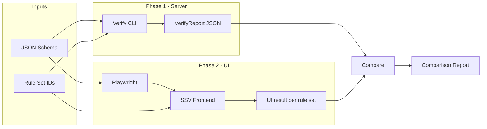

# Phase 2 — Playwright-based UI verification (#51)

**Issue:** [feat(verify): Phase 2 — Playwright-based UI verification #51](https://github.com/codygo-ai/strictly-structured/issues/51)

**Dependency:** Phase 1 (#50) must be complete. Verify CLI and report format are the source of truth for comparison. (Phase 1 = server-side verification via Verify CLI and in-process `validateSchemaForRuleSet` / `fixSchemaForRuleSet`; Phase 2 = Playwright UI verification.)

---

## 1. Goal

Extend the verification system with **Playwright** so that:

1. The **SSV web UI** is exercised end-to-end: open app, paste schema, **select rule set(s)** (click cards), trigger validation, and run the **fix workflow** (in scope; second slice).
2. **UI-reported results** (per rule set: valid/invalid, error counts) are **compared** to Phase 1 server-side results for the same schema and rule sets.
3. A **comparison report** (server vs UI) is produced; tests fail on mismatch so CI can enforce consistency.

---

## 2. High-level flow



- **Phase 1:** For each test schema, run Verify CLI (or in-process `validateSchemaForRuleSet`) to get `valid` + `errors`/`warnings` per rule set.
- **Phase 2:** Playwright drives the frontend with the same schema; we **select** each rule set (click its card) so the Issues tab and Fix flow apply to that rule set; we capture from the DOM the validation result per rule set (valid/invalid, error count).
- **Compare:** For each (schema, ruleSet), assert server and UI agree; write a comparison report (JSON or markdown).

---

## 3. Codebase context

### 3.1 Frontend (SSV web app)

| Item            | Location                                                      | Notes                                                                                                     |
| --------------- | ------------------------------------------------------------- | --------------------------------------------------------------------------------------------------------- |
| App entry       | `packages/frontend/src/app/page.tsx`                          | Playground: SchemaEditor + CompatibilityDashboard                                                         |
| Schema editor   | `packages/frontend/src/components/SchemaEditor.tsx`           | Monaco editor; value/onChange                                                                             |
| Validation hook | `packages/frontend/src/hooks/useAllRuleSetsValidation.ts`     | Debounced; calls `validateSchemaForRuleSet` from `@ssv/schemas`                                           |
| Results UI      | `packages/frontend/src/components/CompatibilityDashboard.tsx` | Rule-set tabs, Issues/Reference                                                                           |
| Rule-set card   | `packages/frontend/src/components/RuleSetStatusCard.tsx`      | Shows displayName, errorCount, warningCount, status (Compatible / N issues / Invalid JSON / Not a Schema) |
| Issues + Fix    | `packages/frontend/src/components/IssuesTab.tsx`              | Lists markers; "Fix all" calls `fixSchemaForRuleSet`                                                      |

Default dev URL: **http://localhost:3000** (Next.js).

### 3.2 Phase 1 verify and report format

| Item         | Location                        | Notes                                                                  |
| ------------ | ------------------------------- | ---------------------------------------------------------------------- |
| CLI          | `packages/verify/src/cli.ts`    | `pnpm --filter @ssv/verify run verify <path> --no-llm -o report.json`  |
| Report types | `packages/verify/src/types.ts`  | `VerifyReport`, `DocumentReport`, `RuleSetReport`, `ValidationOutcome` |
| Write report | `packages/verify/src/report.ts` | `writeReport(report, outputPath)` → JSON                               |

**Relevant shape for comparison (per document, per rule set):**

- `ruleSetResults[].validation.valid` (boolean)
- `ruleSetResults[].validation.errors` (array of markers)
- `ruleSetResults[].validation.warnings` (array)

So for each (schema, ruleSetId) we compare: **valid** and **error count** (and optionally warning count).

### 3.3 Test data

- **Phase 1 samples:** `packages/schemas/data/validationSamples/` — many JSON schema files by rule set (e.g. `gpt-4-o1/minimal-object.json`). Reuse a subset for E2E so the server baseline matches Phase 1.

---

## 4. Implementation plan

### 4.1 Playwright setup

- **Location:** Add **`e2e/`** at **repo root** (no new `@ssv/*` package). Keeps E2E separate and avoids polluting app packages.
- **Files to add:**
  - `e2e/playwright.config.ts` — baseURL from env `PLAYWRIGHT_BASE_URL` or `BASE_URL`, default `http://localhost:3000`; one project (e.g. Chromium); timeout/retries as needed.
  - `e2e/package.json` (optional) with `@playwright/test` and script `"test": "playwright test"`, or install Playwright at root and run from root with config in `e2e/`.
- **Root `package.json`:** Add script e.g. `"e2e": "playwright test --config e2e/playwright.config.ts"` (if Playwright is at root) so from repo root: `pnpm run e2e`.
- **Dependency:** Add `@playwright/test` (dev) at root or in `e2e/package.json`. Run `pnpm i` after changes.

### 4.2 Stable selectors (frontend changes)

To avoid brittle DOM selectors, add **`data-testid`** attributes so Playwright can find elements reliably:

- **Rule-set cards:** In `RuleSetStatusCard.tsx`, add `data-testid={`rule-set-card-${ruleSet.ruleSetId}`}` on the button. **Required for comparison tests:** add `data-testid="rule-set-error-count"` (and optionally `data-testid="rule-set-warning-count"`) on an element that exposes the **numeric** value (e.g. `data-error-count={errorCount}` or a span with the number). Do **not** parse display strings like "N issues" — that is brittle if copy changes.
- **Dashboard container:** In `CompatibilityDashboard.tsx`, add a wrapper with `data-testid="compatibility-dashboard"`.
- **Issues tab / Fix button:** In `IssuesTab.tsx`, add `data-testid="issues-tab"` and `data-testid="fix-all-button"` (or equivalent).
- **Schema editor:** In `SchemaEditor.tsx`, add `data-testid="schema-editor"` on the wrapper so E2E can focus and set content.

These test IDs are for E2E only and must not change without updating `e2e/tests/`.

### 4.3 Setting schema in the UI

- **Option B (recommended for comparison tests and CI):** Add a **test-only** mechanism: e.g. query param `?schema=<base64>` or a hidden control that sets the editor content from a string, only when `process.env.NODE_ENV === 'test'` or a special env. Playwright navigates to `http://localhost:3000?schema=...` or triggers the control. This is more reliable than keyboard simulation in CI; Monaco’s contenteditable/shadow structure makes `page.fill()` and paste flaky.
- **Option A (optional for local/smoke):** Use Playwright to focus the Monaco editor and paste (e.g. `page.keyboard.press('Meta+a'); page.keyboard.insertText(schemaJson)`). Use for quick local runs only; comparison tests and CI should use Option B.

### 4.4 One E2E test (first slice)

- **Test:** e.g. `e2e/tests/validation.spec.ts`.
- **Steps:**
  1. Navigate to base URL.
  2. Set schema (one known invalid schema, e.g. minimal object without `required`/`additionalProperties`) using the chosen method (paste or test-only set).
  3. **Wait for validation to settle:** The validation hook is debounced (~200 ms). Do **not** use a fixed sleep. Wait for the UI to show results: e.g. `await expect(page.getByTestId('compatibility-dashboard')).toBeVisible()` and at least one `rule-set-card-*` with final status. This ensures debounce has completed before assertions.
  4. **Select** a rule set by clicking its card (e.g. `rule-set-card-openai-gpt-4o`); assert the Issues tab shows that rule set’s issues (and Fix applies to that rule set).
  5. Assert for at least one rule set: status indicates invalid and error count &gt; 0 (e.g. text contains "issue" or "2 issues").
- This validates that the UI flow runs, rule-set selection works, and validation results are shown; no comparison to Phase 1 yet.

### 4.5 Phase 1 baseline in tests

- **Option A — CLI:** In the test (or a beforeAll), run `pnpm --filter @ssv/verify run verify <path> --no-llm -o e2e/tmp/report.json`, then read `e2e/tmp/report.json` and parse `VerifyReport`. Use one schema file (e.g. copy a sample to `e2e/fixtures/schema.json`).
- **Option B — In-process:** In the Playwright test file (Node context), import `validateSchemaForRuleSet` from `@ssv/schemas/ruleSetValidator` and the rule set list from `@ssv/schemas`; for the same JSON string, call the validator per rule set and build a small structure `{ ruleSetId, valid, errorCount }`. No CLI, no temp file; same logic as frontend.
- Recommendation: **Option B** for speed and no subprocess; add a small helper in `e2e/` that, given a schema string, returns server results per rule set using `@ssv/schemas`.

### 4.6 Comparison and comparison report

- For each test case (one or more schemas):
  - **Server:** valid + errorCount (and optionally warningCount) per rule set (from Phase 1 helper or report JSON).
  - **UI:** valid + errorCount per rule set (from DOM). Read **numeric** error count from `data-testid="rule-set-error-count"` (or a `data-*` attribute) on each card — do not parse display strings like "N issues". Derive valid from status (e.g. "Compatible" vs error/warning state).
- **Match rule:** Consider a (schema, ruleSet) a **match** if `valid` is the same and `errorCount` is the same. Optionally compare `warningCount`.
- **Report:** Write to `e2e/results/comparison-<timestamp>.json` (or similar) an array of: `{ schemaId, ruleSetId, serverValid, serverErrorCount, uiValid, uiErrorCount, match }`. If any `match === false`, the test fails.
- **Assertion:** In the test, after comparing, `expect(mismatches).toHaveLength(0)` (or equivalent) with a clear message listing mismatches.

### 4.7 Fix workflow (in scope for #51; second slice)

- **In scope:** Testing the fix workflow through the UI is part of #51. Implement in a **second slice** after validation comparison is stable.
- In a separate test: after loading an invalid schema, **select** the rule set, click "Fix all" (via `data-testid="fix-all-button"`), wait for the editor to update (or for a success indicator), then either:
  - Assert the editor content contains expected changes (e.g. `additionalProperties: false`), or
  - Run Phase 1 fix (e.g. `fixSchemaForRuleSet`) and compare fixed schema from UI to server fixed schema (normalize JSON and compare).

### 4.8 Server validation path (in scope for #51; dedicated slice)

- **In scope:** The issue summary explicitly mentions "trigger validation" via the server path. Testing the **"Validate on server"** button is part of #51, not optional. Implement as a **dedicated slice** after client-side validation comparison is stable.
- The UI has a **"Validate on server"** button that calls `/api/validate`. Add a test that clicks it (e.g. `data-testid="server-validate-button"`), waits for the response, and asserts the UI updates (e.g. server state shown). Optionally compare that UI-reported result to Phase 1 for the same schema.

### 4.9 Test data subset

- Create **`e2e/fixtures/`** and add one or two schema files (e.g. `invalid-openai.json` — missing required/additionalProperties; `valid-all.json` — valid for all providers). Optionally copy from `packages/schemas/data/validationSamples/` or reference that path if tests run from root.
- Document in this doc which fixtures are used and that they align with Phase 1 samples for consistency.

---

## 5. Deliverables checklist

- [x] **Plan doc (this file)** — `docs/verify-phase2.md` in the repo (done).
- [x] **Playwright config** — `e2e/playwright.config.ts` with baseURL, timeouts, one browser project.
- [x] **Dependencies** — `@playwright/test` added (root or `e2e/package.json`); `pnpm i` run.
- [x] **Root script** — `package.json` script to run e2e (e.g. `pnpm run e2e`).
- [x] **Frontend test IDs** — `data-testid` on RuleSetStatusCard, CompatibilityDashboard, IssuesTab (and Fix button).
- [x] **First E2E test** — Open app, set schema, wait for dashboard, assert at least one rule set shows invalid with errors.
- [x] **Phase 1 helper** — In-process validation helper in `e2e/` that returns per-rule-set valid/errorCount for a schema string.
- [x] **Comparison test** — Same flow + server baseline; compare valid and errorCount per rule set; fail on mismatch.
- [x] **Comparison report** — Write JSON (or markdown) to `e2e/results/` with server vs UI and match flag.
- [x] **Select-rule-set step** — In tests: click rule-set card, assert Issues tab (and Fix) apply to that rule set.
- [x] **Fix workflow test** — Second slice: load invalid schema, select rule set, Fix all, assert editor or compare fixed schema to Phase 1.
- [x] **Error count from DOM** — Use `data-testid="rule-set-error-count"` (or numeric `data-*`) for comparison; do not parse "N issues" text.
- [x] **Server-validate test** (in scope #51) — Dedicated slice: click "Validate on server", assert UI updates; optionally compare to Phase 1.
- [x] **README or section here** — "How to run": start frontend (`pnpm run dev:frontend` or `pnpm run dev`), then `pnpm run e2e`; optional env `BASE_URL` (local or deployed).

---

## 6. How to run (for implementers)

1. **Start the app** so the frontend reads `?schema=` and the backend is reachable (for server-validate):
   ```bash
   pnpm run dev:e2e
   ```
   This runs the full stack (frontend + backend + emulators) with `NEXT_PUBLIC_E2E=true`. Or: `NEXT_PUBLIC_E2E=true pnpm dev`.
2. **Run E2E tests:**
   ```bash
   pnpm run e2e
   ```
   The browser closes when the run finishes (normal). To watch the run: `pnpm run e2e:headed`. To keep the browser open after a test: `pnpm run e2e:debug`.
   After changing `@ssv/schemas`, restart the frontend so the fix-workflow test uses the latest fixer. The server-validate test skips when the request does not start (e.g. no backend or auth).
   **Base URL:** Use a **local** URL or a **deployed** one (e.g. preview). Override via env:
   ```bash
   BASE_URL=http://localhost:3001 pnpm run e2e
   BASE_URL=https://preview-xxx.vercel.app pnpm run e2e
   ```
   CI can use a deployed preview URL so the job does not need to start the app.
3. **Results:** Test output in the terminal; comparison report in `e2e/results/` (if implemented).

---

## 7. CI (follow-up)

- Add a CI job (e.g. GitHub Actions) that:
  1. Installs deps, builds frontend.
  2. Starts the frontend in the background **or** sets `BASE_URL` to a deployed preview URL (recommended when available).
  3. Runs `pnpm run e2e`.
  4. Uploads `e2e/results/*` as artifacts on failure.
- Out of scope for the first slice; document here as Phase 2 follow-up.

---

## 8. References

- Phase 1 verify: [packages/verify](../packages/verify)
- Frontend playground: [packages/frontend/src/app/page.tsx](../packages/frontend/src/app/page.tsx)
- Validation types: [packages/verify/src/types.ts](../packages/verify/src/types.ts)
- Rule set data: [packages/schemas/data/schemaRuleSets.json](../packages/schemas/data/schemaRuleSets.json) (and [validationSamples](../packages/schemas/data/validationSamples))
